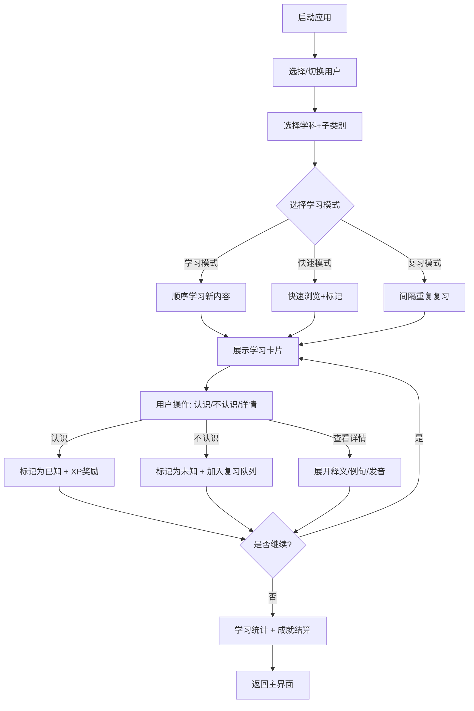
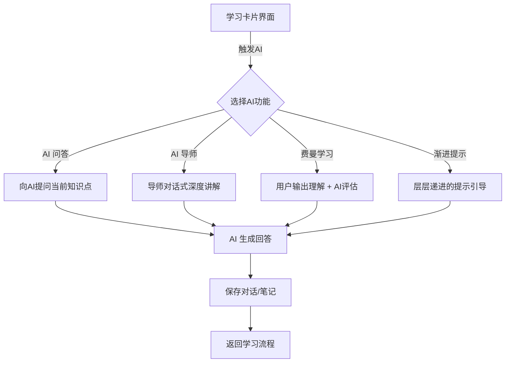
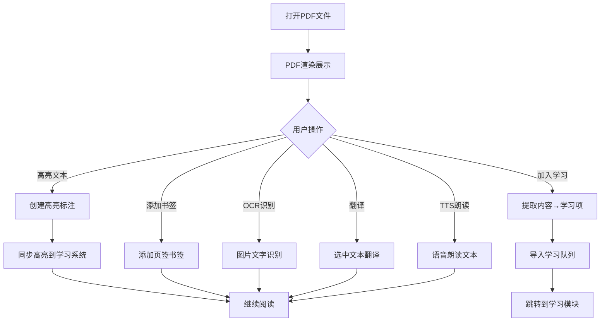

# LearningAssistant 业务梳理文档

> **文档说明**：梳理 LearningAssistant 的用户角色、核心业务流程和用户痛点。

---

## 一、用户角色

| 角色名称 | 角色描述 | 核心目标 | 主要使用场景 | 占比估算 |
|---------|---------|---------|-------------|---------|
| **主动学习者** | 有明确学习目标，主动规划学习的用户 | 高效记忆知识、达成学习目标 | 日常学习、复习、目标管理 | 60% |
| **应试备考者** | 应对考试（语言/学科/职业）的用户 | 短时高效突破、错题强化 | 集中刷题、错题复习、模拟测试 | 25% |
| **兴趣探索者** | 碎片化时间学习、兴趣驱动的用户 | 轻松获取知识、保持学习习惯 | 碎片学习、收藏浏览、AI 对话 | 10% |
| **内容管理者** | 大量导入/整理学习内容的用户 | 高效管理知识库、内容分类 | 批量导入、目录管理、标签整理 | 5% |

---

## 二、核心业务流程

### 2.1 主学习流程

### 2.2 AI 增强学习流程

### 2.3 PDF 深度阅读流程

---

## 三、用户痛点分析

| 痛点编号 | 痛点描述 | 影响角色 | 痛点等级 | 对应现有功能 | 改善方向 |
|---------|---------|---------|---------|-------------|---------|
| P-001 | 学习入口分散，不同来源的内容学习体验不一致 | 主动学习者 | 🔴 高 | 学习/错题/收藏/路径各自为政 | 统一学习引擎，标准化卡片交互 |
| P-002 | AI 能力分散在多个面板，切换繁琐 | 全部角色 | 🟠 中高 | 问答/导师/费曼/提示各独立 | 整合 AI 侧边栏，统一对话入口 |
| P-003 | 大量学习项时加载慢、卡顿 | 内容管理者 | 🔴 高 | 全量加载到内存 | 分页+虚拟列表+懒加载 |
| P-004 | 学习推荐不够智能，难以针对性强化薄弱点 | 应试备考者 | 🟠 中高 | 基础推荐算法 | 引入知识图谱+薄弱点分析+个性化路径 |
| P-005 | 数据安全担忧，本地存储易丢失 | 全部角色 | 🟠 中高 | 百度网盘备份 | 自动备份+多端同步+增量备份 |
| P-006 | 学习反馈不够及时，难以保持动力 | 兴趣探索者 | 🟡 中 | 游戏化系统已有基础 | 强化即时反馈+成就体系+社交激励 |
| P-007 | 学习数据统计维度单一，无法深度分析 | 主动学习者 | 🟡 中 | 基础图表统计 | 多维数据分析+学习效率评估+建议生成 |
| P-008 | 移动端缺失，只能在电脑前学习 | 全部角色 | 🔴 高 | 纯桌面端 | 移动端/Web端规划（远期） |
