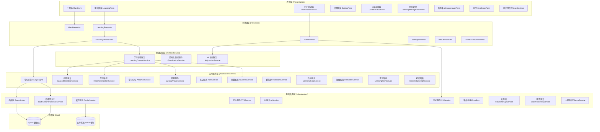

# LearningAssistant 方案设计文档

> **文档说明**：输出 LearningAssistant 的系统分层架构、模块拆分、核心数据实体、功能清单和验收标准。

---

## 一、系统分层架构

---

## 二、模块拆分

| 模块名称 | 模块职责 | 核心服务/组件 | 依赖模块 |
|---------|---------|-------------|---------|
| **核心学习模块** | 学习引擎、卡片展示、学习流程控制 | StudyEngine, LearningFlowHandler, LearningCard | 无（核心） |
| **记忆算法模块** | 间隔重复算法、复习调度 | SM2Algorithm, FSRSAlgorithm, SpacedRepetitionService | 核心学习 |
| **AI 增强模块** | AI 问答、导师、费曼学习、渐进提示 | AiQuestionService, MentorAIPanel, FeynmanLearningPanel | 核心学习 |
| **PDF 学习模块** | PDF 阅读、标注、OCR、翻译、TTS | PdfiumPdfService, PdfOcrService, PdfTranslationService | 核心学习 |
| **游戏化模块** | 等级/XP、成就、徽章、挑战、庆祝 | GamificationService, AchievementService, BadgeManager | 核心学习 |
| **错题本模块** | 错题收集、分类、复习、掌握度 | WrongAnswerService, WrongAnswerForm | 核心学习 |
| **笔记模块** | 笔记管理、关联学习项、标签 | NoteService, NotesForm | 核心学习 |
| **收藏模块** | 多级收藏夹、收藏项管理 | FavoritesService, BookmarkManagerForm | 核心学习 |
| **番茄钟模块** | 番茄计时、休息提醒、统计 | PomodoroService, PomodoroTimer | 无（独立） |
| **学习目标模块** | 目标设置、追踪、日历 | LearningGoalService, GoalCalendarView | 核心学习 |
| **提醒模块** | 学习提醒、定时提醒 | SqliteLearningReminderService, ReminderNotificationForm | 学习目标 |
| **学习路径模块** | 自定义路径、进度追踪 | LearningPathService, LearningPath | 核心学习 |
| **知识图谱模块** | 知识点关联、可视化 | KnowledgeGraphService, KnowledgeGraphView | 核心学习 |
| **数据分析模块** | 学习统计、图表、报告 | LearningAnalyticsService, LearningChartService, LearningReportService | 核心学习 |
| **TTS 语音模块** | 语音合成、发音协调 | KokoroSharpTtsService, QwenTtsService, SpeechCoordinator | 无（基础设施） |
| **用户管理模块** | 多用户切换、用户档案 | UserSessionService, UserProfileRepository | 无（基础设施） |
| **内容管理模块** | 内容导入导出、编辑器 | DataImportService, ExportService, ContentEditorForm | 核心学习 |
| **系统基础设施** | 缓存、配置、日志、主题、热键、托盘 | CacheService, ThemeManager, HotkeyService, TrayIconService | 无（基础） |

---

## 三、核心数据实体

### 3.1 实体关系图

```mermaid
erDiagram
    USER_PROFILE ||--o{ CATEGORY_PROGRESS : has
    USER_PROFILE ||--o{ LEARNING_RECORD : has
    USER_PROFILE ||--o{ REMINDER : has
    USER_PROFILE ||--o{ BADGE_UNLOCK : has
    USER_PROFILE ||--o{ STUDY_STATS : has
    USER_PROFILE ||--o{ DAILY_CHALLENGE : has
    USER_PROFILE ||--o{ CHALLENGE_HISTORY : has
    USER_PROFILE ||--o{ LEARNING_GOAL : has
    USER_PROFILE ||--o{ DAILY_GOAL_RECORD : has
    USER_PROFILE ||--o{ FAVORITE_FOLDER : has
    USER_PROFILE ||--o{ FAVORITE_ITEM : has
    USER_PROFILE ||--o{ POMODORO_SETTINGS : has
    USER_PROFILE ||--o{ POMODORO_RECORD : has
    USER_PROFILE ||--o{ WRONG_ANSWER : has
    USER_PROFILE ||--o{ NOTE : has
    USER_PROFILE ||--o{ LEARNING_PATH : has
    USER_PROFILE ||--o{ SPACED_REPETITION_ITEM : has

    SPACED_REPETITION_ITEM ||--o{ REVIEW_LOG : has
    REMINDER ||--o{ REMINDER_REPEAT_DAY : has
    LEARNING_PATH ||--o{ LEARNING_PATH_ITEM : contains
    FAVORITE_FOLDER ||--o{ FAVORITE_ITEM : contains

    LEARNING_ITEM_STATE }o--|| CATEGORY_PROGRESS : tracks

    USER_PROFILE {
        string UserId PK
        string UserName
        DateTime LastLoginTime
        int XP
        int Level
        int Coins
        int ConsecutiveStudyDays
        int TotalStudyTimeMinutes
    }

    LEARNING_ITEM {
        string Id PK
        string Subject
        string SubCategory
        string MainContent
        string MeaningJson
        string ExampleJson
        string Status
        int ReviewCount
        DateTime CreatedAt
        DateTime UpdatedAt
    }

    SPACED_REPETITION_ITEM {
        Guid Id PK
        string Content
        string Answer
        int Interval
        int Repetitions
        double EFactor
        DateTime NextReviewDate
        int WrongCount
        int CorrectCount
        double Stability
        double Difficulty
        int LearningStage
        string AlgorithmType
    }

    REVIEW_LOG {
        int Id PK
        Guid ContentId FK
        int Rating
        int Interval
        DateTime ReviewTime
        int Duration
    }

    WRONG_ANSWER {
        string Id PK
        string Subject
        string Category
        string Question
        string CorrectAnswer
        string UserAnswer
        string Explanation
        int WrongCount
        int CorrectCount
        double Difficulty
        int MasteryLevel
        DateTime NextReviewAt
    }

    NOTE {
        string Id PK
        string Title
        string Content
        string Category
        string Tags
        string RelatedType
        string RelatedItemId
        int Importance
        bool IsFavorite
    }

    LEARNING_GOAL {
        int Id PK
        string GoalType
        int TargetValue
        string Unit
        bool Enabled
    }

    REMINDER {
        Guid Id PK
        string Type
        string Title
        TimeSpan Time
        string RepeatType
        bool Enabled
        int TriggerCount
    }
```

### 3.2 核心实体说明

| 实体名称 | 实体类型 | 核心字段 | 聚合根 | 仓储 |
|---------|---------|---------|-------|------|
| UserProfile | 实体 | UserId, UserName, XP, Level, ConsecutiveStudyDays | ✅ 是 | IUserProfileRepository |
| LearningItem | 实体 | Id, Subject, SubCategory, MainContent, Status | ✅ 是 | ILearningItemRepository |
| SpacedRepetitionItem | 实体 | Id, Content, Interval, NextReviewDate, Stability | ✅ 是 | ISpacedRepetitionRepository |
| WrongAnswer | 实体 | Id, Question, CorrectAnswer, MasteryLevel, NextReviewAt | ✅ 是 | IWrongAnswerRepository |
| Note | 实体 | Id, Title, Content, Tags, RelatedItemId | ✅ 是 | INoteRepository |
| FavoriteFolder/Item | 实体 | Id, Name, ParentId, Content, ItemType | ✅ 是 | IFavoritesRepository |
| LearningGoal | 实体 | Id, GoalType, TargetValue, Enabled | ✅ 是 | ILearningGoalRepository |
| Reminder | 实体 | Id, Type, Title, Time, RepeatType | ✅ 是 | IReminderRepository |
| LearningPath | 实体 | Id, Name, Description, IsActive | ✅ 是 | ILearningPathRepository |
| PomodoroRecord | 实体 | Id, StartTime, EndTime, Type, Completed | ✅ 是 | IPomodoroRepository |

---

## 四、功能清单（按优先级）

### 4.1 P0 - 核心功能（必须）

| 功能编号 | 功能名称 | 功能描述 | 验收要点 |
|---------|---------|---------|---------|
| F-001 | 多学科卡片学习 | 支持8大学科、30+子分类的卡片式学习 | 所有子类别卡片正确展示、认识/不认识标记 |
| F-002 | 间隔重复复习 | 基于 SM2/FSRS 算法的智能复习调度 | 复习间隔计算正确、到期自动提醒 |
| F-003 | TTS 语音朗读 | 本地/云端双引擎语音合成 | 发音清晰、自动播放、字段级发音 |
| F-004 | 学习数据持久化 | SQLite 存储用户数据 | 数据不丢失、崩溃可恢复 |
| F-005 | 多用户切换 | 支持多用户独立学习数据 | 用户数据隔离、切换正常 |

### 4.2 P1 - 重要功能（应该有）

| 功能编号 | 功能名称 | 功能描述 | 验收要点 |
|---------|---------|---------|---------|
| F-006 | AI 问答助手 | 基于 AI 的知识点问答讲解 | AI 回答准确、上下文连贯 |
| F-007 | PDF 学习集成 | PDF 阅读、标注、内容提取 | 正常打开PDF、高亮/书签可用 |
| F-008 | 游戏化系统 | 等级/XP/成就/徽章/挑战 | 奖励计算正确、成就触发正常 |
| F-009 | 错题本 | 错题收集、分类、复习 | 错题自动记录、复习有效 |
| F-010 | 学习统计分析 | 学习数据可视化图表 | 数据准确、图表清晰 |
| F-011 | 番茄钟 | 番茄工作法计时 | 计时准确、提醒正常 |
| F-012 | 学习目标 | 每日目标设置与追踪 | 目标可设置、进度可追踪 |
| F-013 | 收藏夹 | 多级文件夹收藏管理 | 收藏/取消/分类正常 |
| F-014 | 笔记系统 | 学习笔记管理 | 笔记可增删改查、可关联学习项 |

### 4.3 P2 - 增强功能（可以有）

| 功能编号 | 功能名称 | 功能描述 | 验收要点 |
|---------|---------|---------|---------|
| F-015 | 费曼学习法 | 用户输出理解 + AI 评估 | AI 评估合理、反馈有价值 |
| F-016 | AI 导师 | 对话式深度讲解 | 引导式提问、个性化讲解 |
| F-017 | 渐进提示 | 层层递进的提示引导 | 提示分级合理、不直接给答案 |
| F-018 | 知识图谱 | 知识点关联可视化 | 图谱生成合理、交互流畅 |
| F-019 | 学习路径 | 自定义学习路径规划 | 路径可创建、进度可追踪 |
| F-020 | 每日挑战 | 每日学习任务挑战 | 挑战生成合理、奖励正确 |
| F-021 | 学习提醒 | 定时学习提醒 | 提醒准时、可配置 |
| F-022 | 内容导入导出 | Excel 批量导入导出 | 导入不丢失、导出格式正确 |
| F-023 | 云存储备份 | 百度网盘同步备份 | 备份正常、恢复可用 |
| F-024 | OCR 文字识别 | PDF/图片文字识别 | 识别准确、支持中英文 |
| F-025 | 翻译功能 | 中英文互译 | 翻译准确、支持 PDF 取词 |

---

## 五、验收标准

### 5.1 功能验收标准

| 验收维度 | 验收标准 | 度量方法 |
|---------|---------|---------|
| **学习功能** | 30+ 子类别学习卡片展示正常，认识/不认识标记正确 | 全类别遍历测试 |
| **算法正确性** | 间隔重复算法计算结果与标准算法一致 | 单元测试覆盖率 > 90% |
| **数据完整性** | 学习数据持久化不丢失，崩溃可恢复 | 异常退出测试 + 数据校验 |
| **AI 可用性** | AI 问答响应时间 < 5s（网络正常时），回答相关 | 性能测试 + 人工评估 |
| **PDF 兼容性** | 支持常见 PDF 文件，渲染无错乱 | 多种 PDF 样本测试 |
| **语音质量** | TTS 发音清晰可懂，无明显卡顿 | 人工试听 + 响应时间测试 |

### 5.2 性能验收标准

| 性能指标 | 验收标准 | 测试条件 |
|---------|---------|---------|
| 应用启动时间 | < 3 秒 | 冷启动，常规配置机器 |
| 学习项加载 | 1万条数据 < 1 秒 | 标准测试数据集 |
| 卡片切换 | < 200ms | 连续快速切换 |
| 内存占用 | 常规使用 < 500MB | 1万条数据量下 |
| TTS 响应 | 本地 TTS < 500ms，云端 < 2s | 正常网络环境 |
| PDF 打开 | 100页以内 < 2s | 标准 PDF 文档 |

### 5.3 兼容性验收标准

| 兼容性维度 | 验收标准 |
|---------|---------|
| **操作系统** | Windows 7 SP1 及以上全版本兼容 |
| **.NET 版本** | 依赖 .NET 10 Desktop Runtime |
| **高 DPI** | 100%/125%/150%/200% 缩放无错乱 |
| **数据兼容** | 旧版 JSON 数据可平滑迁移到 SQLite |
| **分辨率** | 最小支持 1366×768 分辨率 |

### 5.4 安全验收标准

| 安全维度 | 验收标准 |
|---------|---------|
| **配置安全** | API Key 等敏感配置加密存储 |
| **数据安全** | 用户学习数据本地存储，不上传（除非用户主动备份） |
| **异常安全** | 异常退出不损坏数据文件 |
| **输入安全** | 用户输入内容做长度/格式校验，防止注入 |
